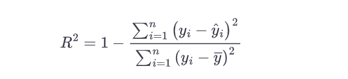
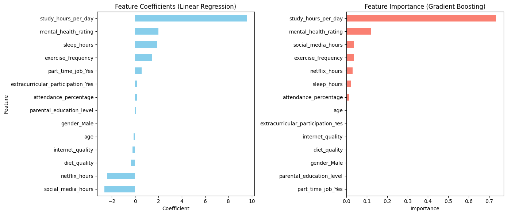
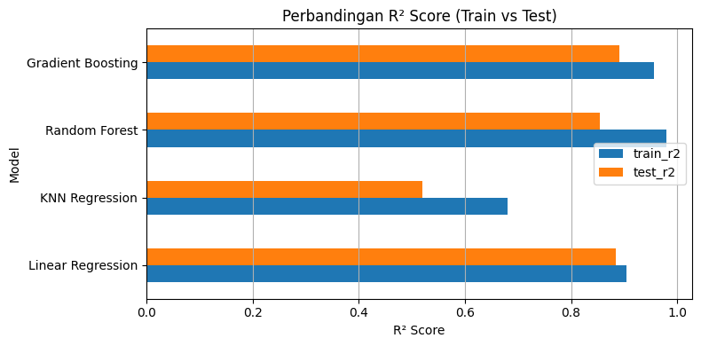

# Laporan Proyek Machine Learning - Vanessa Audrie Tanaka

## Domain Proyek

Performa akademik siswa merupakan salah satu indikator penting dalam menilai keberhasilan pendidikan. Namun, performa ini tidak hanya ditentukan oleh faktor intelektual, melainkan juga dipengaruhi oleh berbagai kebiasaan sehari-hari seperti durasi tidur, durasi belajar, konsumsi kafein, penggunaan media sosial, hingga kebiasaan belajar. Sayangnya, masih banyak siswa dan institusi pendidikan yang belum menyadari pentingnya faktor-faktor non-akademik tersebut dalam mendukung pencapaian belajar.

Beberapa penelitian mengungkap pengaruh kebiasaan siswa terhadap hasil belajar. Penelitian oleh Reuter et al. (2020) menyatakan bahwa pola makan sehat, seperti konsumsi sarapan secara rutin, memiliki efek positif terhadap nilai akademik, sementara konsumsi makanan cepat saji justru berdampak negatif. Namun, faktor lain seperti pola tidur mungkin memiliki dampak yang lebih relevan. Carrión-Pantoja et al. (2022) melakukan penelitian mengenai hubungan insomnia, kebersihan saat tidur, dan kesehatan mental. Hasil penelitian menunjukkan bahwa stres, kecemasan, dan kualitas tidur memiliki peran penting. Insomnia yang dipicu oleh buruknya kebersihan tidur, rendahnya efisiensi tidur, dan depresi secara signifikan berhubungan dengan penurunan prestasi belajar. 

Penelitian oleh Redondo-Flórez et al. (2022) juga menunjukkan bahwa kesehatan fisik seperti VO2 max, tekanan darah diastolik, dan insomnia akibat gangguan pernapasan memiliki hubungan yang relevan dengan performa akademik, menunjukkan pentingnya intervensi terhadap kebugaran dan kualitas tidur siswa. Selain itu, Troll et al. (2021) meneliti hubungan penggunaan gawai dengan hasil akademis, dan menemukan bahwa penggunaan smartphone yang tidak terkontrol serta prokrastinasi berdampak negatif terhadap nilai akademik. Sebaliknya, siswa dengan pengendalian diri yang tinggi memiliki performa yang lebih baik karena mampu mengelola penggunaan smartphone secara efektif.

Temuan-temuan ini menunjukkan bahwa prediksi performa akademik tidak hanya relevan, tetapi juga sangat krusial sebagai dasar preventif. Masalah ini penting untuk diselesaikan karena:

- **Pemahaman yang Lebih Baik**: Analisis data dapat membantu siswa dan pendidik memahami kebiasaan apa saja yang paling berkaitan dengan hasil belajar.
- **Preventif dan Intervensi Dini**: Prediksi performa akademik berdasarkan kebiasaan dapat membantu siswa lebih berantisipasi dan bertanggung jawab terhadap kebiasaan yang mereka jalani sehari-hari, sehingga berpotensi memperbaiki performa belajar secara bertahap.
- **Pengambilan Keputusan Berbasis Data**: Guru dan konselor pendidikan dapat menggunakan hasil model untuk memberikan bimbingan yang lebih personal dan objektif.

Melalui pendekatan analisis data dan model regresi, proyek ini bertujuan memberikan gambaran tentang pentingnya gaya hidup terhadap performa belajar.

**Referensi:**

- Carrión-Pantoja, S., et al. (2022). *Insomnia symptoms, sleep hygiene, mental health, and academic performance in Spanish university students: A cross-sectional study*. Journal of Clinical Medicine, 11(7), 1989. https://doi.org/10.3390/jcm11071989  
- Redondo-Flórez, L., et al. (2022). *Relationship between physical fitness and academic performance in university students*. IJERPH, 19(22), 14750. https://doi.org/10.3390/ijerph192214750  
- Reuter, P. R., et al. (2020). *The influence of eating habits on the academic performance of university students*. Journal of American College Health, 69(8), 921–927. https://doi.org/10.1080/07448481.2020.1715986  
- Troll, E. S., et al. (2021). *How students’ self-control and smartphone use explain their academic performance*. Computers in Human Behavior, 117, 106624. https://doi.org/10.1016/j.chb.2020.106624

## Business Understanding
### **Problem Statements:**
- Pernyataan Masalah 1 
Sangat memungkinkan bagi siswa untuk mengalami penurunan performa akademik bukan karena kemampuan intelektual, tetapi karena faktor gaya hidup seperti kurang tidur, konsumsi makanan tidak sehat, penggunaan media sosial berlebihan, dan pola belajar yang tidak teratur. Banyak yang masih tidak melakukan pendekatan analisis data untuk mengetahui pengaruh masing-masing faktor tersebut terhadap nilai akhir siswa.

- Pernyataan Masalah 2 
Belum diketahui pendekatan model regresi mana yang paling bagus untuk menjelaskan hubungan antara kebiasaan siswa dengan performa akademik, padahal pemilihan metode yang sesuai dapat membantu memberikan insight yang lebih mendalam.

### **Goals:**
- Jawaban Masalah 1 
Mengidentifikasi faktor-faktor kebiasaan siswa yang paling signifikan memengaruhi performa akademik berdasarkan hasil analisis regresi. Tujuannya adalah memberikan insight yang berguna bagi siswa dan pendidik agar dapat fokus memperbaiki aspek gaya hidup yang paling berpengaruh terhadap hasil belajar.

- Jawaban Masalah 2 
Mengevaluasi dan membandingkan hasil dari beberapa algoritma regresi seperti Linear Regression, K Nearest Neighbor, Random Forest, dan Gradient Boosting untuk melihat pendekatan mana yang paling baik dalam menjelaskan hubungan antara variabel gaya hidup dan nilai akademik siswa.

### **Solution Statements:**
- Eksplorasi dan pemodelan multivariat menggunakan beberapa model untuk mendapatkan model yang terbaik:
  - Linear Regression
  - K-Nearest Neighbors (KNN) Regression
  - Random Forest Regression
  - Gradient Boosting Regression

- Evaluasi model menggunakan metrik:
  - R-squared (R²)

- Visualisasi:
  - Histogram  untuk visualisasi data numerik 
  - Barchart untuk visualisasi data kategorikal
  - Korelasi antar variabel (heatmap)
  - Barplot prediksi vs aktual untuk mengevaluasi model
  - Feature importance dan Feature coefficient

## Data Understanding
### Dataset 
Proyek ini menggunakan dataset Student Habits vs Academic Performance yang diambil melalui Kaggle di [Link Dataset](https://www.kaggle.com/datasets/jayaantanaath/student-habits-vs-academic-performance)

Dataset ini bertujuan untuk membantu memahami pengaruh kebiasaan siswa terhadap performa akademik, targetnya adalah exam_score. Dataset ini berisi informasi mengenai gaya hidup, kebiasaan belajar, dan karakteristik individu siswa yang dikaitkan dengan performa akademik mereka. Dataset ini memiliki total 1000 data.

### Deskripsi Variabel
Berikut adalah daftar fitur (variabel) yang terdapat dalam dataset:
- student_id: ID setiap siswa
- age: Usia siswa
- gender: Jenis kelamin siswa
-  study_hours_per_day: Rata-rata jam belajar siswa
- social_media_hours_per_day: rata-rata jam bermain media sosial
- netflix_hours: Rata-rata jam menonton film
- part_time_job: Ada atau tidaknya siswa tersebut bekerja paruh waktu
- attendance_percentage: Persentase kehadiran siswa
- sleep_hours: Rata-rata jam tidur siswa
- diet_quality: Kualitas pola makan siswa (Poor/Fair/Good)
- exercise_frequency: Berapa kali siswa olahraga dalam seminggu
- parental_education: Jenjang pendidikan orang tua
- internet_quality: Kualitas internet siswa (Good/Average/Poor)
- mental_health_rating: Rating kesehatan mental siswa dalam skala 1-10
- extracurricular_participation: Ada atau tidaknya siswa mengikuti extracuricular
- exam_score: Nilai akhir siswa (target variabel untuk prediksi).

### Tahapan Awal Eksplorasi Data 
Beberapa tahapan eksplorasi dan pemahaman data yang dilakukan:
- Load Dataset: Memuat dataset dan memeriksa informasi dataset.
- Deskripsi Data Numerik: Mendapatkan statistik deskriptif untuk fitur numerik.
- Cek Missing Values dan Duplikat: Memastikan apakah ada data yang hilang atau duplikat.
- Memisahkan variabel menjadi dua kategori: numerik dan kategorikal.
- Visualisasi Data Numerik: Menggunakan histogram untuk melihat distribusi variabel numerik.
- Deteksi outlier: Menggunakan boxplot untuk mengidentifikasi data yang berada di luar kisaran normal (outliers).
- Visualisasi Data Kategorikal: Menggunakan bar chart untuk memvisualisasikan distribusi variabel kategorikal.
- Correlation Matrix: Membuat matrix korelasi untuk melihat hubungan antar variabel numerik.

### Visualisasi yang dilakukan: 
- Histogram: Digunakan untuk menggambarkan distribusi variabel numerik.
- Boxplot: Digunakan untuk melihat ouliers yang ada di data numerik.
- Bar Chart: Digunakan untuk melihat distribusi nilai kolom kategorikal
- Correlation Matrix: Digunakan untuk melihat korelasi antar variabel numerik. 

## Data Preparation
Ditahap ini, dilakukan beberapa proses cleaning dan transforming data
- Menghapus data yang null: Diperlukan untuk menghindari error saat pelatihan model serta menjaga integritas data. Karena jumlah data kosong sangat sedikit, maka baris yang mengandung nilai null dihapus secara langsung.
- Menghapus kolom yang tidak berpengaruh pada proses selanjutnya: Kolom student_id dihapus karena hanya merupakan identifier unik yang tidak memiliki kontribusi terhadap prediksi.
- Menghapus 'Others' dalam kolom gender: Umumnya jenis kelamin hanya ada 2. Oleh karena itu, baris dengan gender 'Others' dihapus dari dataset.
- Melakukan encoding kolom kategorikal
 - Label Encoding: diet_quality, parental_education_level, internet_quality
   - diet_quality ('Poor': 0, 'Fair': 1, 'Good': 2)
   - parental_education_level ('High School': 0, 'Bachelor': 1, 'Master': 2)
   - internet_quality ('Poor': 0, 'Average': 1, 'Good': 2)
 - Binary Encoding: gender, part_time_job, extracurricular_participation
   - gender
   - part_time_job, extracurricular_participation
- Split data ke train dan test: Dataset dibagi dengan rasio 80:20 menggunakan train_test_split agar model dapat dievaluasi performanya pada data baru yang tidak dilatih sebelumnya.
- Standarisasi data dengan standard scaler: Standarisasi diperlukan terutama untuk model-model seperti KNN dan regresi berbasis gradien yang sensitif terhadap skala data. Data dinormalisasi agar seluruh fitur memiliki rata-rata 0 dan standar deviasi 1, sehingga mempercepat proses pelatihan dan meningkatkan akurasi model.

## Modeling
Beberapa algoritma regresi yang digunakan adalah:

### **1. Linear Regression**  
Linear Regression adalah model dasar untuk regresi, digunakan sebagai baseline. Model ini berguna untuk melihat apakah hubungan antara fitur dan target bersifat linear.  
**Parameter:**  
- Tidak ada parameter khusus yang ditentukan karena menggunakan yang default dari Linear Regression.

**Kelebihan:**  
- Cepat dan efisien untuk dataset kecil sampai menengah.  
- Hasil model mudah diinterpretasikan (koefisien menunjukkan arah pengaruh variabel).  
- Tidak mudah overfitting.

**Kekurangan:**  
- Tidak cocok untuk data yang mengandung hubungan non-linear.  
- Rentan terhadap outlier.  

### **2. K-Nearest Neighbors (KNN) Regression**  
KNN Regression sangat intuitif dan tidak membuat asumsi bentuk hubungan antara variabel. Cocok untuk melihat apakah hubungan antara fitur dan target bisa diwakili oleh kedekatan nilai fitur.  
**Parameter:**  
- n_neighbors=7: Menggunakan 7 tetangga terdekat untuk membuat prediksi. Jika menggunakan terlalu sedikit model akan overfitting, jika terlalu banyak maka model akan underfit.

**Kelebihan:**  
- Dapat menangani hubungan non-linear antar variabel.  
- Sangat fleksibel terhadap bentuk data.

**Kekurangan:**  
- Boros memori dan waktu saat prediksi (harus menghitung jarak ke semua data).  
- Sangat sensitif terhadap skala fitur (perlu standardisasi).  
- Performanya menurun pada dataset berdimensi tinggi.

### **3. Random Forest Regression**  
Random Forest cocok untuk data dengan banyak fitur dan kompleksitas tinggi. Ia menggabungkan banyak decision tree untuk meningkatkan generalisasi dan menghindari overfitting.  
**Parameter:**  
- n_estimators=100: Jumlah pohon yang digunakan untuk membentuk forest.  
- random_state=42: Untuk memastikan hasil yang konsisten.

**Kelebihan:**  
- Menangani hubungan non-linear dan interaksi antar fitur.  
- Robust terhadap outlier dan noise.  
- Memberikan feature importance untuk interpretasi.

**Kekurangan:**  
- Interpretasi lebih sulit dibanding Linear Regression.  
- Cukup mahal secara komputasi untuk dataset besar.  
- Bisa overfitting jika jumlah pohon terlalu sedikit atau terlalu dalam.

### **4. Gradient Boosting Regression**  
Gradient Boosting Regression membangun model secara bertahap dan fokus pada kesalahan prediksi sebelumnya. Cocok untuk masalah regresi yang kompleks.  
**Parameter:**  
- n_estimators=100: Jumlah pohon yang digunakan dalam boosting.  
- random_state=42: Untuk memastikan hasil replikasi.

**Kelebihan:**  
- Sangat akurat jika dituning dengan benar.  
- Menangani relasi non-linear dan interaksi antar variabel dengan baik.  
- Memberikan fitur penting seperti Random Forest.

**Kekurangan:**  
- Sensitif terhadap parameter tuning.  
- Lebih lambat dibanding Random Forest karena sifatnya yang sekuensial.  
- Bisa overfitting jika jumlah estimator terlalu besar tanpa regularisasi.

### **Proses Pelatihan Model**  
Semua model dilatih dengan data training (X_train, y_train) yang telah dipersiapkan pada tahap sebelumnya. Setiap model difit secara individual, dan hasilnya disimpan dalam dictionary `fitted_models` untuk evaluasi lebih lanjut dalam menentukan model terbaik.

## Evaluation
R² (R-squared) adalah metrik yang digunakan untuk mengukur seberapa baik model dapat menjelaskan variasi dalam data target. Metrik ini sangat berguna  untuk menentukan seberapa baik model menangkap hubungan antara fitur dan target. R² cocok digunakan dalam proyek ini karena tujuan utama adalah memilih model yang paling efektif dalam memprediksi nilai akademik berdasarkan kebiasaan siswa. Dengan R², kita bisa mengetahui seberapa baik model memanfaatkan fitur-fitur untuk memprediksi hasil akademik siswa.

**Kenapa Menggunakan R²?**

1. **Tujuan Membandingkan Model**: R² membantu membandingkan model-model yang berbeda untuk melihat mana yang paling baik dalam menjelaskan hubungan antara input (fitur) dan output (target). Model dengan nilai R² lebih tinggi lebih baik dalam memprediksi nilai target.
   
2. **Fokus pada Kekuatan Prediksi**: R² menunjukkan proporsi variasi target yang dapat dijelaskan oleh model. Model yang lebih baik akan memiliki R² lebih mendekati 1, yang berarti model tersebut mampu menangkap sebagian besar variasi dalam data.
   
3. **Penting untuk Pemilihan Fitur**: R² tidak hanya digunakan untuk mengevaluasi model, tetapi juga dapat digunakan untuk melihat fitur mana yang paling berkontribusi terhadap prediksi dengan menggunakan koefisien model (untuk model linear) atau feature importance (untuk model berbasis pohon seperti Random Forest).

### Rumus R²

**Keterangan:**
- $y_i$ = Nilai aktual (observasi asli) dari data.
- $\hat{y}_i$ = Nilai prediksi (hasil model).
- $\bar{y}$ = Rata-rata nilai aktual (mean dari nilai \( y_i \)).
- $n$ = Jumlah data.

**Penjelasan:**
- **pembilang**: $\sum (y_i - \hat{y}_i)^2$ adalah jumlah kuadrat kesalahan atau residual sum of squares (RSS). Ini menunjukkan seberapa besar perbedaan antara nilai yang diprediksi dan nilai aktual.
  
- **penyebut**: $\sum (y_i - \bar{y})^2$ adalah total sum of squares (TSS). Ini menunjukkan seberapa besar variasi dalam data aktual, yaitu perbedaan antara nilai aktual dan nilai rata-rata.

Visualisasi hasil evaluasi menggunakan barplot horizontal karena:

- Barplot memudahkan perbandingan antar model secara visual.
- Visualisasi ini juga membantu mengidentifikasi apakah ada overfitting (nilai R² tinggi di training tapi rendah di testing), dan menunjukkan model mana yang paling stabil serta generalizable.

## Conclusion
**Masalah 1:**
- Untuk ke 2 model, study_hours_per_day adalah faktor yang paling berpengaruh. Semakin banyak waktu belajar, semakin tinggi nilai.
- mental_health_rating berada di posisi ke 2 untuk Gradient Boosting, Kesehatan mental memiliki dampak positif terhadap performa akademik.
- Namun untuk Linear Regression social_media_hours dan netflix_hours lebih berpengaruh, namun pengaruhnya negatif, artinya semakin banyak waktu dihabiskan untuk hiburan dan media sosial, semakin menurun nilai.
- sleep_hours dan exercise_frequency juga memiliki pengaruh terhadap nilai akhir siswa.

 **Masalah 2:**
Model terbaik adalah Gradient Boosting dengan akurasi test 0.8910, diikuti dengan Linear regression dengan akurasi 0.8848. Pemilihan model terbaik diambil melalui metrik evaluasi R²

